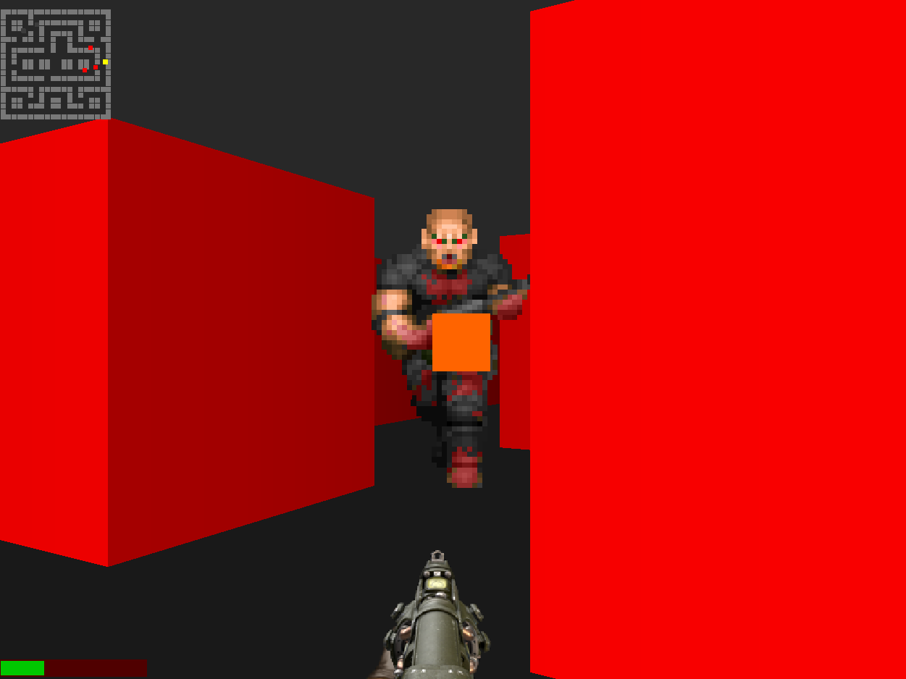

## cubedoom

This is a lightweight arena shooter, consisting over under 1000 LOC, and raycasting rendering.

To build, clone this repository, and install:

- The [Spectre Programming Language](https://spectrelang.org) Toolchain
- SDL2 Dev Dependency
- SDL2_Image Dev Dependency

And run `./build.sh`

